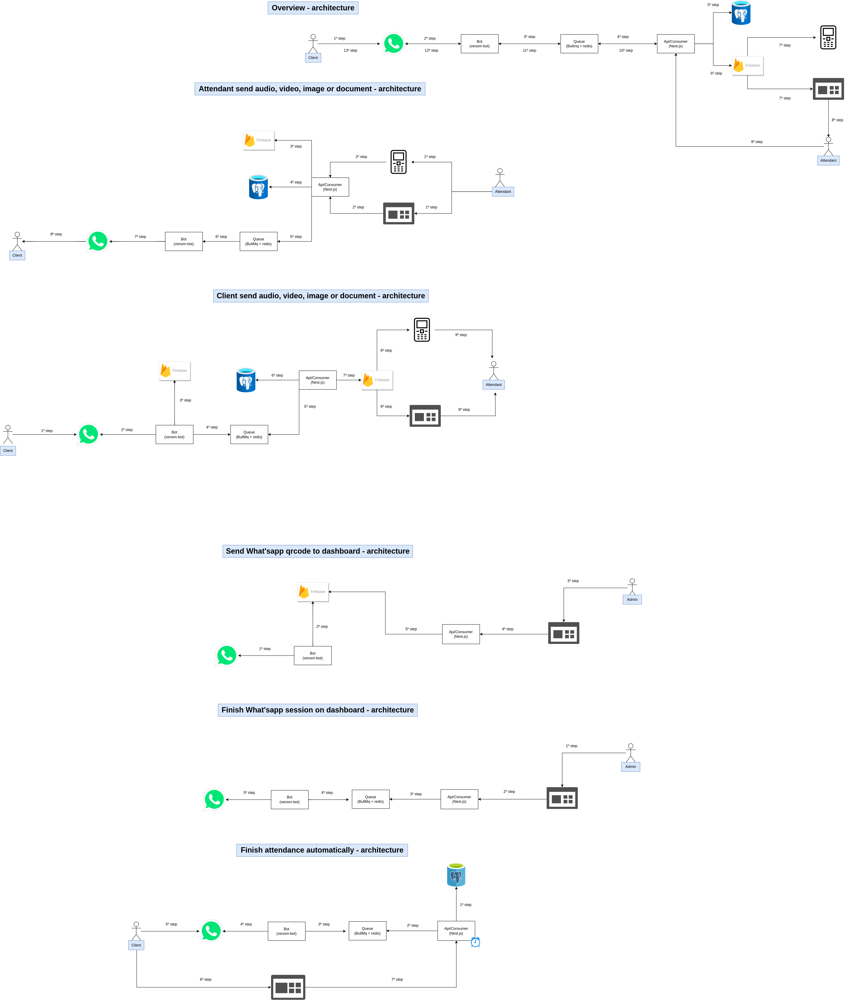

## About project architecture 

## Overview - architecture

- 1º step: client send message via What'sapp
- 2º step: the bot application listen new message received in What'sapp number
- 3º step: Get new message and send to queue
- 4º step: api/consumer get message
- 5º step: Save client in database, create attendance in database
- 6º step: send data to firebase(firestore) about new message sended in whatsapp number
- 7º step: notify all clients connected via websocket in firebase(firestore) about new message
- 8º step: attendant see new message
- 9º step: attedant send message to help client. The attendant type message, client send, frontend application make request to api.
- 10º step: the api save data in database
- 11º step: the api publish message to queue
- 12º step: the bot application get attendant message 
- 13º step: send to client via venom-bot library.

## Attendant send audio, video, image or document - architecture

- 1º step: attendant send audio, video or document to client
- 2º step: the client application make request to api 
- 3º step: upload audio, video, image or document in firebase(storage)
- 4º step: save data about message in database
- 5º step: send mensage to queue
- 6º step: the bot application get message
- 7º step: the bot application send message with media to What'sapp using library(venom-bot)

## Client send audio, video, image or document - architecture

- 1º step: client send audio, video or document to client via What'sapp
- 2º step: the bot application get message
- 3º step: upload audio, video, image or document in firebase(storage)
- 4º step: send mensage to queue
- 5º step: the api/consumer get message in queue
- 6º step: got message and save in database
- 7º step: the api save event about new message in firebase(firestore)
- 8º step: firebase notify all client applications connected in firebase(firestore) about new message
- 9º step: client see new message in dashboard or mobile application.

## Send What'sapp qrcode to dashboard - architecture

- 1º step: the bot application get qrcode 
- 2º step: upload qrcode to firebase(storage)
- 3º step: Admin or Attendant manager access page in dashboard to scan qrcode
- 4º step: frontend application make request to api
- 5º step: api get qrcode uploaded in firebase(storage)

## Finish What'sapp session on dashboard - architecture

- 1º step: Admin or attendant manger access dashboard
- 2º step: click button to logout and dashboard make request to api
- 3º step: api publish message to queue to logout 
- 4º step: the bot application get message and finish What'sapp session.

## Finish attendance automatically - architecture

- 1º step: api has schedule task that execute each 5 minutes where execute query to get attendances don't have message  within 30 minutes.
- 2º step: If exist attedances don't have message within 30 minutes close attendance and publish message to queue where this message ask feedback about attendance
- 3º step: the bot application get message 
- 4º step: the bot send message via whatsapp 
- 5º step: Client seed message about feedback
- 6º step: Client click in link sended in message and load public page in dasboard(web) where him can give feedback about attendance
- 7º step: Client give feedback about attendance and dashboard send data to api 

