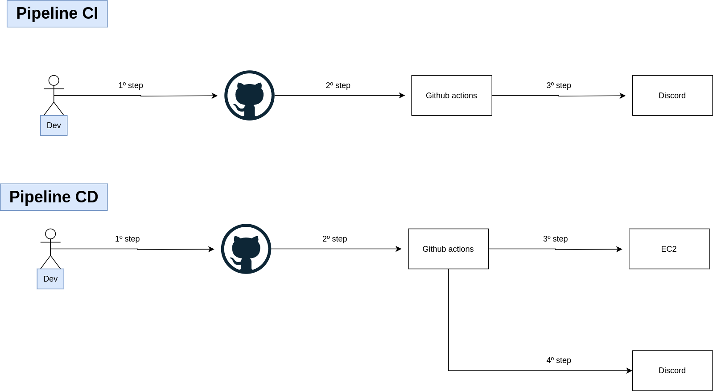

## About pipeline CI/CD

## What is CI or continuous integration?

The "CI" in CI/CD always refers to continuous integration, which is an automation process for developers. Successful CI means new code changes to an app are regularly built, tested, and merged to a shared repository. It’s a solution to the problem of having too many branches of an app in development at once that might conflict with each other.

## What is CD or continuous deploy?

The "CD" in CI/CD refers to continuous delivery and/or continuous deployment, which are related concepts that sometimes get used interchangeably. Both are about automating further stages of the pipeline, but they’re sometimes used separately to illustrate just how much automation is happening.

Continuous delivery usually means a developer’s changes to an application are automatically bug tested and uploaded to a repository (like GitHub or a container registry), where they can then be deployed to a live production environment by the operations team. It’s an answer to the problem of poor visibility and communication between dev and business teams. To that end, the purpose of continuous delivery is to ensure that it takes minimal effort to deploy new code.

## Pipeline CI

- 1º step: developer send code Github repository and open pull request to reviewer review your code and approve or reprove.
- 2º step: In moment open pull request Github actions start run pipeline ci where execute test and make sure all good before approve.
- 3º step: Notify via Discord if Github actions pipeline executed with success or fail.

## Pipeline CD

- 1º step: developer send code Github repository and open pull request to reviewer review your code and approve or reprove. 
- 2º step: After approve code and send code to branch master Github actions start run pipeline CD. 
- 3º step: Pipeline connect via ssh in EC2 machine execute all commands needs to upload aplication with new features.
- 4º step: Notify via Discord if Github actions pipeline executed with success or fail.